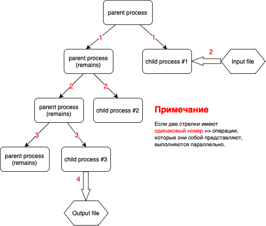

### Фортов Егор Кириллович, БПИ214
### Вариант 23

## Задание:
Разработать программу, которая ищет в ASCII-строке заданную подстроку и возвращает индекс первого символа первого вхождения подстроки в строке. Подстрока вводится как параметр.
> Программа на 4 балла (именованные каналы, 3 процесса)   

<video width="320" height="240" controls>
  <source src="scheme_animated.mp4" type="video/mp4">
</video>

### Входные данные
Запуск программы происходит с помощью выполнения исполняемого файла с 3 аргументами командной строки:
 - Имя файла (с расширением), в котором лежит строка (просто цельная строка, без доп. символов), в которой мы будем искать подстроку;
 - Имя файла (с расширением), в который мы будем писать ответ;
 - Подстрока (цельная строка без доп. символов).

### Отчёт о реализации программы
Решение данной задачи было спроектировано, используя многопроцессорность и неимеованные каналы. Было сделано 3 дочерних процесса:
 - 1-ый процесс (child process #1) читает текстовые данные из заданного файла (Input file) и через неименованный канал передает их второму процессу;
 - 2-ой (child process #2) процесс осуществляет обработку данных в соответствии с заданием и передает результат обработки через неименованный канал третьему процессу;
 - 3-ий (child process #3) процесс осуществляет вывод данных в заданный файл (Output file).

> Схема, демонстрирующая архитектуру приложения:

### Результаты тестирования
Было проведено 5 тестов (str - строка, в которойищем подстроку s):
 - str = "abcdefghjklmn"; s = "def"; RESULT: 3 (correct)
 - str = "klklksssmensjs"; s = "sss"; RESULT: 5 (correct)
 - str = "askdlfdekhefkjcabk"; s = "hefkj"; RESULT: 9 (correct)
 - str = "kjdsdjkbnjcefjnledkjbwfejkcewjklefwbn"; s = "lefwbn"; RESULT: 31 (correct)
 - str = "jkewncalkefunqwklruilqwadjkbefjkfkabekfuif"; s = "lefwbn"; RESULT: -1 (correct)

