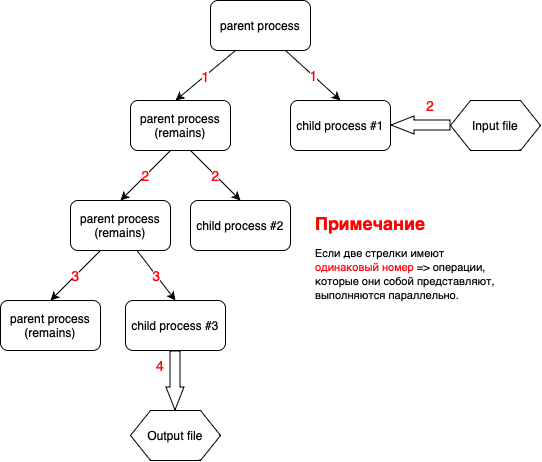
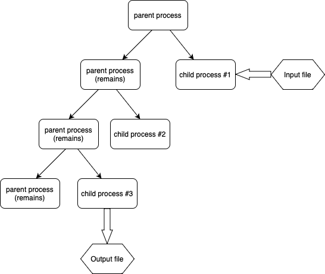

### Фортов Егор Кириллович, БПИ214
### Вариант 23
> Программа на 5 баллов (именованные каналы, 3 процесса)   

## Задание:
Разработать программу, которая ищет в ASCII-строке заданную подстроку и возвращает индекс первого символа первого вхождения подстроки в строке. Подстрока вводится как параметр.

### Входные данные
Запуск программы происходит с помощью выполнения исполняемого файла с 3 аргументами командной строки:
 - Имя файла (с расширением), в котором лежит строка (просто цельная строка, без доп. символов), в которой мы будем искать подстроку;
 - Имя файла (с расширением), в который мы будем писать ответ;
 - Подстрока (цельная строка без доп. символов).

### Отчёт о реализации программы
Решение данной задачи было спроектировано, используя многопроцессорность и именованные каналы. Было сделано 3 дочерних процесса:
 - 1-ый процесс (child process #1) читает текстовые данные из заданного файла (Input file) и через именованный̆ канал fifo.txt передает их второму процессу;
 - 2-ой (child process #2) процесс осуществляет обработку данных в соответствии с заданием и передает результат обработки через именованный̆ канал fifo2.txt третьему процессу;
 - 3-ий (child process #3) процесс осуществляет вывод данных в заданный файл (Output file).

> Схема, демонстрирующая архитектуру приложения:

### Результаты тестирования
Было проведено 5 тестов (str - строка, в которойищем подстроку s):
 - str = "abcdefghjklmn"; s = "def"; RESULT: 3 (correct)
 - str = "klklksssmensjs"; s = "sss"; RESULT: 5 (correct)
 - str = "askdlfdekhefkjcabk"; s = "hefkj"; RESULT: 9 (correct)
 - str = "kjdsdjkbnjcefjnledkjbwfejkcewjklefwbn"; s = "lefwbn"; RESULT: 31 (correct)
 - str = "jkewncalkefunqwklruilqwadjkbefjkfkabekfuif"; s = "lefwbn"; RESULT: -1 (correct)

### Замечания
 - ***Данная программа была переписана с предыдущей программы (на 4 балла) путем внедрения именованных каналов. Теперь транзит данных происходит через именованный канал fifo.txt. Однако для того, чтобы было явно было видно соответствие именованных и неименованных каналов, неименованные каналы были намеренно оставлены (но взаимодействие происходит все равно через именованные каналы).***
 - ***Для наглядности работы программы были поставлены несколько sleep(). Ответ стоит смотреть в output.txt. Все, что выводится в консоли - это DEBUG info.***
 - ***Состояние гонки никак не влияет на ответ, так как отдельные части кода, которые не могут выполняться параллельно, были синхронизированы.***

